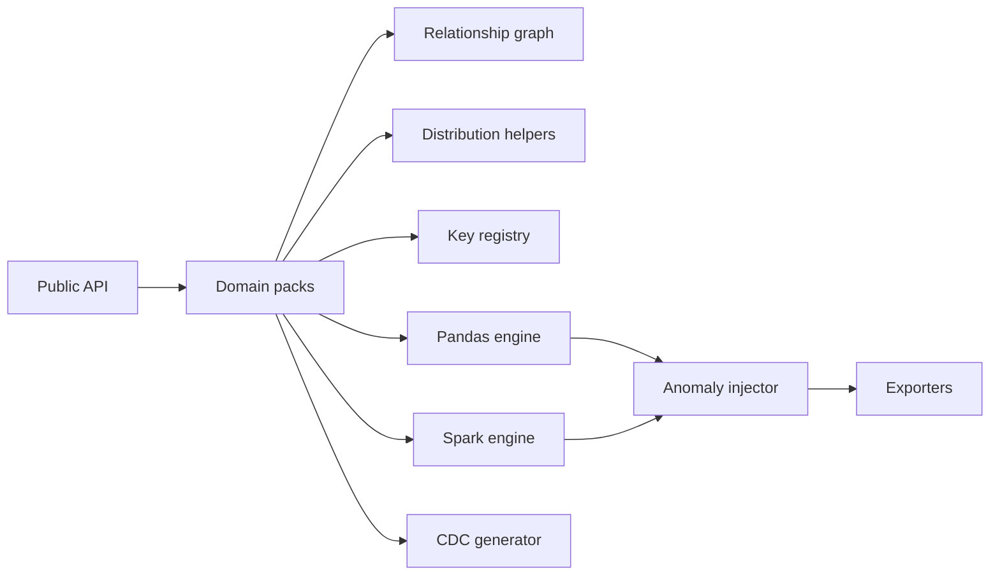

# Enterprise Synth

**Developer-first enterprise synthetic data generation for realistic relational, streaming-style, and Spark-scale datasets.**

> Faker gives you fake values. Enterprise Synth gives you a believable enterprise data system.

Generate realistic enterprise datasets for Spark, Pandas, testing, demos, benchmarking, learning, and research.

```python
from enterprise_synth import generate_domain

data = generate_domain("ecommerce", scale="small", seed=42)

customers = data["customers"]
orders = data["orders"]
```

## Why this exists

Creating useful synthetic data is strangely expensive. Teams need datasets that are:

- relationally consistent
- large enough for pipelines and benchmarks
- realistic enough for demos and teaching
- deterministic enough for tests and research
- messy on demand when validating data quality systems

`Faker` is excellent at generating individual fake values, but production systems are made of tables, keys, events, and behavior over time. `SDV` is valuable when statistical modeling is the core problem, but many engineers need something lighter: domain templates, one-line ergonomics, Spark awareness, export formats, and fast iteration.

Enterprise Synth is built for that middle ground.

## What makes it different

| Tool | Best at | Enterprise Synth difference |
| --- | --- | --- |
| Faker | fake values like names, emails, addresses | generates complete domains with relationships and business behavior |
| SDV | statistical synthetic modeling | stays lightweight, template-driven, developer-first, and Spark/export friendly |
| Enterprise Synth | relational synthetic enterprise systems | focuses on parent-child tables, CDC, anomalies, scale profiles, and lakehouse-ready outputs |

## Installation

```bash
pip install enterprise-synth
pip install enterprise-synth[spark]
pip install enterprise-synth[delta]
```

## Quickstart

```python
from enterprise_synth import generate_domain

data = generate_domain("ecommerce", scale="small", seed=42)

customers = data["customers"]
orders = data["orders"]
order_items = data["order_items"]
```

Returned value:

```python
{
    "customers": customers_df,
    "products": products_df,
    "orders": orders_df,
    "order_items": order_items_df,
    "payments": payments_df,
    "shipments": shipments_df,
    "returns": returns_df,
}
```

## One-line examples worth stealing

```python
# Ecommerce in one line
data = generate_domain("ecommerce")

# Banking CDC
from enterprise_synth import generate_cdc
cdc = generate_cdc("banking", table="customers", rows=10_000, seed=42)

# Research reproducibility
banking = generate_domain("banking", scale="medium", seed=2026)

# Anomaly-rich test data
dirty = generate_domain(
    "ecommerce",
    anomalies={
        "null_rate": 0.03,
        "duplicate_rate": 0.01,
        "late_arrival_rate": 0.02,
        "outlier_rate": 0.005,
    },
)
```

## Pandas examples

### Ecommerce

```python
from enterprise_synth import generate_domain

data = generate_domain("ecommerce", engine="pandas", scale="small", seed=42)

print(data["orders"].head())
print(data["order_items"].head())
```

### Banking

```python
banking = generate_domain("banking", engine="pandas", scale="small", seed=42)

customers = banking["customers"]
transactions = banking["transactions"]
fraud_events = banking["fraud_events"]
```

### Validate relationships

```python
orders = data["orders"]
customers = data["customers"]

assert orders["customer_id"].isin(customers["customer_id"]).all()
```

### Export CSV / JSON / Parquet

```python
generate_domain(
    "ecommerce",
    engine="pandas",
    scale="medium",
    output_path="./synthetic/ecommerce",
    output_format="csv",
)

generate_domain(
    "ecommerce",
    engine="pandas",
    scale="medium",
    output_path="./synthetic/ecommerce_json",
    output_format="json",
)

generate_domain(
    "banking",
    engine="pandas",
    scale="medium",
    output_path="./synthetic/banking_parquet",
    output_format="parquet",
)
```

## Spark examples

```python
from enterprise_synth import generate_domain

data = generate_domain(
    "banking",
    engine="spark",
    scale="large",
    spark=spark,
    seed=42,
)
```

### Parquet export

```python
generate_domain(
    "banking",
    engine="spark",
    scale="large",
    spark=spark,
    output_path="/mnt/lakehouse/banking",
    output_format="parquet",
    partition_by=["event_date"],
)
```

### Delta export

```python
generate_domain(
    "banking",
    engine="spark",
    scale="large",
    spark=spark,
    output_format="delta",
    output_path="/mnt/demo/banking_delta",
    partition_by=["event_date"],
)
```

### Cloud notebook / cluster exports

`engine="spark"` preserves storage URIs and lets the Spark cluster's filesystem layer resolve them.
That means the same API works across common cloud notebook environments:

```python
# AWS / EMR / Databricks on AWS
generate_domain(
    "banking",
    engine="spark",
    spark=spark,
    output_path="s3a://my-bucket/synthetic/banking",
    output_format="parquet",
)

# Azure Databricks / ADLS Gen2
generate_domain(
    "banking",
    engine="spark",
    spark=spark,
    output_path="abfss://container@account.dfs.core.windows.net/synthetic/banking",
    output_format="delta",
)

# GCP Dataproc / Databricks on GCP
generate_domain(
    "ecommerce",
    engine="spark",
    spark=spark,
    output_path="gs://my-bucket/synthetic/ecommerce",
    output_format="parquet",
)

# Databricks volume-style path
generate_domain(
    "ecommerce",
    engine="spark",
    spark=spark,
    output_path="dbfs:/Volumes/catalog/schema/volume/synthetic/ecommerce",
    output_format="delta",
)
```

For pandas, use a local filesystem path:

```python
generate_domain(
    "ecommerce",
    engine="pandas",
    output_path="./synthetic/ecommerce",
    output_format="parquet",
)
```

Remote writes still depend on the runtime being configured correctly:

- Spark must know the relevant filesystem connector (`s3a://`, `abfss://`, `gs://`, and so on).
- The cluster identity must already have storage permissions.
- Delta writes require a runtime with Delta support, such as Databricks Runtime or a Spark session configured for Delta Lake.
- On Databricks, prefer Unity Catalog volumes or external locations over legacy DBFS root and mounts for new projects.

For a fuller platform checklist, see [docs/CLOUD_DEPLOYMENT.md](docs/CLOUD_DEPLOYMENT.md).

### Spark export controls

```python
generate_domain(
    "banking",
    engine="spark",
    spark=spark,
    output_path="s3a://my-bucket/synthetic/banking",
    output_format="parquet",
    partition_by=["event_date"],
    writer_options={"compression": "snappy"},
    num_partitions=32,
    partition_strategy="repartition",
)
```

Use:

- `writer_options` to forward storage-format settings into Spark writers
- `num_partitions` to shape output parallelism and file counts
- `partition_strategy="repartition"` when you need a reshuffle
- `partition_strategy="coalesce"` when you are only shrinking partition counts

## Use cases

Enterprise Synth is useful for:

- enterprise demos and architecture proof-of-concepts
- lakehouse demos and Delta examples
- ETL and CDC pipeline testing
- Spark benchmarking and partition testing
- data quality tool demos
- BI dashboard demos
- dbt-style modeling exercises
- SQL, Pandas, and Spark learning
- ML experiments and repeatable research
- load testing and performance testing
- tutorials, talks, hackathons, and conference presentations

## Domain packs

### Ecommerce

**Tables**

- `customers`
- `products`
- `orders`
- `order_items`
- `payments`
- `shipments`
- `returns`

**Relationships**

```text
customers.customer_id ─▶ orders.customer_id
orders.order_id       ─▶ order_items.order_id
products.product_id   ─▶ order_items.product_id
orders.order_id       ─▶ payments.order_id
orders.order_id       ─▶ shipments.order_id
orders.order_id       ─▶ returns.order_id
```

**Behavior**

- a minority of customers drive a large share of orders
- inactive and newer customers order less often
- category influences pricing
- weekends and holiday periods lift order volume
- failed payments, refunds, shipment delays, and returns are correlated to business flow
- apparel returns more often than grocery

**Generated columns**

| Table | Representative columns |
| --- | --- |
| customers | `customer_id`, `customer_segment`, `signup_date`, `country` |
| products | `product_id`, `category`, `brand`, `list_price` |
| orders | `order_id`, `customer_id`, `order_ts`, `total_amount` |
| order_items | `order_item_id`, `order_id`, `product_id`, `quantity` |
| payments | `payment_id`, `order_id`, `payment_status`, `refunded_amount` |
| shipments | `shipment_id`, `shipment_status`, `delayed` |
| returns | `return_id`, `order_id`, `return_reason`, `refund_amount` |

### Banking

**Tables**

- `customers`
- `accounts`
- `transactions`
- `cards`
- `merchants`
- `fraud_events`
- `cdc_customer_changes`

**Relationships**

```text
customers.customer_id       ─▶ accounts.customer_id
customers.customer_id       ─▶ cards.customer_id
accounts.account_id         ─▶ transactions.account_id
cards.card_id               ─▶ transactions.card_id
merchants.merchant_id       ─▶ transactions.merchant_id
transactions.transaction_id ─▶ fraud_events.transaction_id
customers.customer_id       ─▶ cdc_customer_changes.customer_id
```

**Behavior**

- customers can own multiple accounts and cards
- account type and business ownership influence spend
- transactions increase around payroll dates and weekends
- merchant category changes amount distribution
- fraud stays rare and clustered
- CDC records support inserts, updates, deletes, duplicate flags, and late-arrival flags

**Generated columns**

| Table | Representative columns |
| --- | --- |
| customers | `customer_id`, `customer_type`, `segment`, `risk_band` |
| accounts | `account_id`, `customer_id`, `account_type`, `balance` |
| cards | `card_id`, `customer_id`, `card_type` |
| merchants | `merchant_id`, `merchant_category`, `risk_band` |
| transactions | `transaction_id`, `account_id`, `card_id`, `merchant_id`, `amount` |
| fraud_events | `fraud_event_id`, `transaction_id`, `risk_score` |
| cdc_customer_changes | `operation`, `before`, `after`, `event_timestamp`, `ingestion_timestamp` |

## Export formats

Supported formats:

- `csv`
- `json`
- `parquet`
- `delta`

Outputs are written table-per-folder:

```text
synthetic_data/
  ecommerce/
    customers/
    orders/
    order_items/
    payments/
```

## Anomaly injection

By default, generated data is relationally valid and clean enough for normal demos. Add anomalies only when you want to test resilience.

```python
data = generate_domain(
    "ecommerce",
    anomalies={
        "null_rate": 0.02,
        "duplicate_rate": 0.01,
        "orphan_fk_rate": 0.001,
        "late_arrival_rate": 0.02,
        "out_of_order_rate": 0.01,
        "outlier_rate": 0.005,
        "negative_amount_rate": 0.001,
        "invalid_status_rate": 0.001,
    },
)
```

Supported anomalies:

- nulls
- duplicates
- orphan foreign keys
- late-arriving records
- out-of-order events
- outliers
- skew
- negative amounts
- invalid status codes

## CDC simulation

```python
from enterprise_synth import generate_cdc

cdc = generate_cdc(
    domain="banking",
    table="customers",
    rows=10_000,
    operations=["insert", "update", "delete"],
    late_arrival_rate=0.02,
    duplicate_rate=0.005,
    seed=42,
)
```

CDC output includes:

- `operation`
- `before`
- `after`
- `event_timestamp`
- `ingestion_timestamp`
- `sequence_number`
- `source_system`
- `late_arriving`
- `duplicate`

## Reproducibility

```python
data1 = generate_domain("ecommerce", seed=123)
data2 = generate_domain("ecommerce", seed=123)
```

The same seed produces the same pandas outputs. That makes regression tests, examples, benchmarks, and papers easier to reproduce.

## Scale profiles

| Scale | Intended use |
| --- | --- |
| `tiny` | README examples and unit tests |
| `small` | local development |
| `medium` | notebook demos |
| `large` | Spark and performance work |

Override any table:

```python
generate_domain(
    "ecommerce",
    rows={
        "customers": 100_000,
        "orders": 1_000_000,
        "order_items": 3_000_000,
    },
)
```

## Architecture overview



- **Domain packs** encode tables, columns, relationships, and realistic behavior.
- **Relationship graph** keeps parent tables ahead of children.
- **Key registry** guarantees valid foreign-key sampling.
- **Distribution helpers** provide skew, seasonality, payroll, and weighted behavior.
- **Engines** separate local pandas generation from optional Spark generation.
- **Exporters** write table-per-folder CSV, JSON, Parquet, and Delta outputs.
- **CDC generator** creates event-style changes for pipeline validation.
- **Anomaly injector** adds opt-in quality problems after clean generation.

## Public API

```python
from enterprise_synth import (
    export_data,
    generate_cdc,
    generate_domain,
    generate_from_schema,
    get_domain_schema,
    list_domains,
)
```

## Limitations

- Generated data is synthetic; it is not transformed production data.
- This is not a privacy-preserving transformation toolkit.
- It is not a replacement for full statistical synthetic modeling.
- Spark throughput still depends on your cluster.
- Remote Spark exports depend on the cluster's filesystem connectors, credentials, and cloud IAM setup.
- Delta export depends on runtime support: Databricks Runtime or a Spark session configured for Delta Lake.
- Legacy DBFS root and mounts are not the recommended long-term Databricks storage pattern.
- Spark export helpers do not configure cloud credentials, attach storage, or register catalog tables for you.
- Generic `generate_from_schema(...)` is intentionally lightweight; domain packs provide the richer realism.

## Roadmap

- more domain packs: SaaS, telecom, logistics, healthcare
- SQL DDL support
- schema introspection
- richer streaming / Kafka simulation
- more export formats
- more anomaly controls
- domain-pack authoring helpers
- optional catalog registration helpers
- managed-cloud integration smoke tests

## Contributing

See [CONTRIBUTING.md](CONTRIBUTING.md).

## Project philosophy

The point is not merely to create fake rows. The point is to create synthetic systems that let engineers rehearse reality safely.
