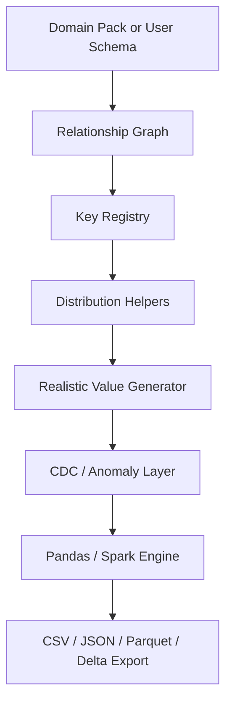

# Great Generator

[](https://github.com/ravikiranpagidi/great-generator/actions/workflows/tests.yml)
[](https://pypi.org/project/great-generator/)
[](https://pypi.org/project/great-generator/)
[](LICENSE)
[](https://github.com/psf/black)
[](https://github.com/astral-sh/ruff)

**Developer-first synthetic enterprise data generation for Pandas, Spark, lakehouse demos, testing, benchmarking, and research.**

> Faker gives you fake values. Great Generator gives you a believable enterprise data system.

Great Generator helps engineers quickly create realistic multi-table datasets with believable values, primary-key/foreign-key relationships, domain behavior, CDC-style records, anomaly injection, and export support for CSV, JSON, Parquet, and Delta.

It is built for data engineers, analytics engineers, Spark users, educators, researchers, hackathon teams, and demo builders who need credible synthetic data without depending on sensitive production data.

> **Privacy note:** Great Generator creates synthetic data from templates. It does **not** anonymize, de-identify, or transform real production data.

```python
from great_generator import generate_domain

data = generate_domain("banking", scale="small", realism="realistic", seed=42)

customers = data["customers"]
accounts = data["accounts"]
transactions = data["transactions"]
```

## Why this exists

Creating useful synthetic data is strangely expensive. Teams need datasets that are:

- relationally consistent
- large enough for pipelines and benchmarks
- realistic enough for demos and teaching
- reproducible enough for tests and research
- messy on demand when validating data quality systems

`Faker` is excellent at generating individual fake values, but production systems are made of tables, keys, events, and behavior over time. `SDV` is valuable when statistical modeling is the core problem, but many engineers need something lighter: domain templates, one-line ergonomics, Spark awareness, export formats, and fast iteration.

Great Generator is built for that middle ground.

## What makes it different

| Tool | Best at | Great Generator difference |
| --- | --- | --- |
| Faker | fake values like names, emails, addresses | generates complete domains with relationships and business behavior |
| SDV | statistical synthetic modeling | stays lightweight, template-driven, developer-first, and Spark/export friendly |
| Great Generator | relational synthetic enterprise systems | focuses on parent-child tables, CDC, anomalies, scale profiles, and lakehouse-ready outputs |

## What this is / is not

Great Generator is for developers who need credible synthetic data quickly.

It is:

- a lightweight Python library
- can produce deterministic output when requested
- useful for pandas, Spark, notebooks, demos, tests, and benchmarks
- built around domain packs, schema generation, exports, CDC, and anomalies

It is not:

- a privacy transformation tool for production data
- a heavyweight ML/statistical synthetic data platform
- a cloud credential manager
- a database, web server, or orchestration framework

## Installation

```bash
pip install great-generator
pip install great-generator[spark]
pip install great-generator[delta]
```

Install with a hyphen, import with an underscore:

```python
import great_generator
```

## Quickstart

```bash
pip install great-generator
```

```python
from great_generator import generate_domain

data = generate_domain(
    "banking",
    scale="small",
    realism="realistic",
    seed=42,
)

customers = data["customers"]
accounts = data["accounts"]
transactions = data["transactions"]

print(customers.head())
```

Returned value:

```python
{
    "customers": customers_df,
    "products": products_df,
    "orders": orders_df,
    "order_items": order_items_df,
    "payments": payments_df,
    "shipments": shipments_df,
    "returns": returns_df,
}
```

## First 5 minutes

```python
from great_generator import generate_domain, generate_from_schema, list_domains

print(list_domains())

ecommerce = generate_domain("ecommerce", scale="tiny")
print(ecommerce["orders"].head())

sample = generate_from_schema(
    "id int, customer_name string, amount double, created_at timestamp",
    rows=10,
)
print(sample)
```

## Realistic value generation

Great Generator supports two realism modes:

```python
generate_domain("banking", scale="small", realism="placeholder")
generate_domain("banking", scale="small", realism="realistic")
```

- `realism="placeholder"` keeps simple deterministic values, useful for debugging and strict tests.
- `realism="realistic"` generates believable names, emails, phone numbers, addresses, company names, merchant names, product names, account types, transaction types, order statuses, claim statuses, and other business values.

The realistic layer is relationship-safe: it enriches descriptive fields but does not rewrite primary keys or foreign keys.

```python
from great_generator import generate_domain

banking = generate_domain("banking", scale="small", realism="realistic", seed=42)
print(banking["customers"][["customer_id", "customer_name", "email"]].head())
```

Example output:

```text
customer_id | customer_name | email
1           | Emily Carter  | emily.carter247@example.com
2           | Arjun Mehta   | arjun.mehta812@example.com
```

### Before and after

```text
Placeholder mode:
customer_id | customer_name   | email
1           | customer_name_1 | user_1@example.com
2           | customer_name_2 | user_2@example.com

Realistic mode:
customer_id | customer_name | email
1           | Emily Carter  | emily.carter247@example.com
2           | Arjun Mehta   | arjun.mehta812@example.com
```

## Who should use this?

Great Generator is useful for:

- data engineers building pipeline demos
- Spark and Databricks users testing lakehouse patterns
- analytics engineers building semantic model demos
- BI developers creating dashboards without production data
- teachers and workshop speakers needing realistic datasets
- researchers needing repeatable synthetic datasets
- hackathon teams needing realistic starter data

## How is this different from Faker?

Faker creates realistic individual values.

Great Generator creates realistic connected business datasets.

Faker can generate a name or address. Great Generator can generate a banking system with customers, accounts, transactions, merchants, balances, CDC records, anomalies, and export-ready tables.

```python
# Faker gives individual values
fake.name()
fake.email()

# Great Generator gives a connected enterprise dataset
data = generate_domain("banking", scale="small", realism="realistic")

customers = data["customers"]
accounts = data["accounts"]
transactions = data["transactions"]
```

## One-line examples worth stealing

```python
# Ecommerce in one line
data = generate_domain("ecommerce")

# Banking CDC
from great_generator import generate_cdc
cdc = generate_cdc("banking", table="customers", rows=10_000)

# Healthcare demo data
healthcare = generate_domain("healthcare", scale="small")

# Telecom usage data
telecom = generate_domain("telecom", scale="small")

# Insurance claims demo
insurance = generate_domain("insurance", scale="small")

# Manufacturing quality data
manufacturing = generate_domain("manufacturing", scale="small")

# Medium banking dataset
banking = generate_domain("banking", scale="medium")

# Anomaly-rich test data
dirty = generate_domain(
    "ecommerce",
    anomalies={
        "null_rate": 0.03,
        "duplicate_rate": 0.01,
        "late_arrival_rate": 0.02,
        "outlier_rate": 0.005,
    },
)
```

## Pandas examples

### Ecommerce

```python
from great_generator import generate_domain

data = generate_domain("ecommerce", engine="pandas", scale="small")

print(data["orders"].head())
print(data["order_items"].head())
```

### Banking

```python
banking = generate_domain("banking", engine="pandas", scale="small")

customers = banking["customers"]
transactions = banking["transactions"]
fraud_events = banking["fraud_events"]
```

### Validate relationships

```python
orders = data["orders"]
customers = data["customers"]

assert orders["customer_id"].isin(customers["customer_id"]).all()
```

### Export CSV / JSON / Parquet

```python
generate_domain(
    "ecommerce",
    engine="pandas",
    scale="medium",
    output_path="./synthetic/ecommerce",
    output_format="csv",
)

generate_domain(
    "ecommerce",
    engine="pandas",
    scale="medium",
    output_path="./synthetic/ecommerce_json",
    output_format="json",
)

generate_domain(
    "banking",
    engine="pandas",
    scale="medium",
    output_path="./synthetic/banking_parquet",
    output_format="parquet",
)
```

## Spark examples

```python
from great_generator import generate_domain

data = generate_domain(
    "banking",
    engine="spark",
    scale="large",
    spark=spark,
)
```

### Parquet export

```python
generate_domain(
    "banking",
    engine="spark",
    scale="large",
    spark=spark,
    output_path="/mnt/lakehouse/banking",
    output_format="parquet",
    partition_by=["event_date"],
)
```

### Delta export

```python
generate_domain(
    "banking",
    engine="spark",
    scale="large",
    spark=spark,
    output_format="delta",
    output_path="/mnt/demo/banking_delta",
    partition_by=["event_date"],
)
```

### Cloud notebook / cluster exports

`engine="spark"` preserves storage URIs and lets the Spark cluster's filesystem layer resolve them.
That means the same API works across common cloud notebook environments:

```python
# AWS / EMR / Databricks on AWS
generate_domain(
    "banking",
    engine="spark",
    spark=spark,
    output_path="s3a://my-bucket/synthetic/banking",
    output_format="parquet",
)

# Azure Databricks / ADLS Gen2
generate_domain(
    "banking",
    engine="spark",
    spark=spark,
    output_path="abfss://container@account.dfs.core.windows.net/synthetic/banking",
    output_format="delta",
)

# GCP Dataproc / Databricks on GCP
generate_domain(
    "ecommerce",
    engine="spark",
    spark=spark,
    output_path="gs://my-bucket/synthetic/ecommerce",
    output_format="parquet",
)

# Databricks volume-style path
generate_domain(
    "ecommerce",
    engine="spark",
    spark=spark,
    output_path="dbfs:/Volumes/catalog/schema/volume/synthetic/ecommerce",
    output_format="delta",
)
```

For pandas, use a local filesystem path:

```python
generate_domain(
    "ecommerce",
    engine="pandas",
    output_path="./synthetic/ecommerce",
    output_format="parquet",
)
```

Remote writes still depend on the runtime being configured correctly:

- Spark must know the relevant filesystem connector (`s3a://`, `abfss://`, `gs://`, and so on).
- The cluster identity must already have storage permissions.
- Delta writes require a runtime with Delta support, such as Databricks Runtime or a Spark session configured for Delta Lake.
- On Databricks, prefer Unity Catalog volumes or external locations over legacy DBFS root and mounts for new projects.

For a fuller platform checklist, see [docs/CLOUD_DEPLOYMENT.md](docs/CLOUD_DEPLOYMENT.md).

### Spark export controls

```python
generate_domain(
    "banking",
    engine="spark",
    spark=spark,
    output_path="s3a://my-bucket/synthetic/banking",
    output_format="parquet",
    partition_by=["event_date"],
    writer_options={"compression": "snappy"},
    num_partitions=32,
    partition_strategy="repartition",
)
```

Use:

- `writer_options` to forward storage-format settings into Spark writers
- `num_partitions` to shape output parallelism and file counts
- `partition_strategy="repartition"` when you need a reshuffle
- `partition_strategy="coalesce"` when you are only shrinking partition counts

## Use cases

Great Generator is useful for:

- enterprise demos and architecture proof-of-concepts
- lakehouse demos and Delta examples
- ETL and CDC pipeline testing
- Spark benchmarking and partition testing
- data quality tool demos
- BI dashboard demos
- dbt-style modeling exercises
- SQL, Pandas, and Spark learning
- ML experiments and repeatable research
- load testing and performance testing
- tutorials, talks, hackathons, and conference presentations

## Domain packs

Available domain packs:

- `banking` - retail banking-style customers, accounts, cards, transactions, fraud, and CDC
- `insurance` - policyholders, agents, policies, claims, payments, risk, and reinsurance
- `telecom` - customers, plans, devices, subscriptions, usage, invoices, and support
- `automotive` - customers, dealers, vehicles, sales, service, warranty, and telematics
- `healthcare` - patients, providers, facilities, encounters, claims, prescriptions, and labs
- `ecommerce` - retail customers, products, orders, payments, shipments, and returns
- `energy` - customers, sites, meters, usage readings, outages, rates, and bills
- `manufacturing` - suppliers, plants, products, work orders, production, quality, and inventory
- `logistics` - shippers, warehouses, carriers, products, shipments, tracking, and inventory
- `media` - users, content, subscriptions, viewing events, ads, and game sessions
- `public_sector` - residents, agencies, programs, applications, cases, payments, and services
- `hospitality` - customers, properties, rooms, reservations, stays, payments, and reviews
- `saas` - organizations, users, plans, subscriptions, features, product usage, invoices, and support

### Ecommerce

**Tables**

- `customers`
- `products`
- `orders`
- `order_items`
- `payments`
- `shipments`
- `returns`

**Relationships**

```text
customers.customer_id -> orders.customer_id
orders.order_id       -> order_items.order_id
products.product_id   -> order_items.product_id
orders.order_id       -> payments.order_id
orders.order_id       -> shipments.order_id
orders.order_id       -> returns.order_id
```

**Behavior**

- a minority of customers drive a large share of orders
- inactive and newer customers order less often
- category influences pricing
- weekends and holiday periods lift order volume
- failed payments, refunds, shipment delays, and returns are correlated to business flow
- apparel returns more often than grocery

**Generated columns**

| Table | Representative columns |
| --- | --- |
| customers | `customer_id`, `customer_segment`, `signup_date`, `country` |
| products | `product_id`, `category`, `brand`, `list_price` |
| orders | `order_id`, `customer_id`, `order_ts`, `total_amount` |
| order_items | `order_item_id`, `order_id`, `product_id`, `quantity` |
| payments | `payment_id`, `order_id`, `payment_status`, `refunded_amount` |
| shipments | `shipment_id`, `shipment_status`, `delayed` |
| returns | `return_id`, `order_id`, `return_reason`, `refund_amount` |

### Banking

**Tables**

- `customers`
- `accounts`
- `transactions`
- `cards`
- `merchants`
- `fraud_events`
- `cdc_customer_changes`

**Relationships**

```text
customers.customer_id       -> accounts.customer_id
customers.customer_id       -> cards.customer_id
accounts.account_id         -> transactions.account_id
cards.card_id               -> transactions.card_id
merchants.merchant_id       -> transactions.merchant_id
transactions.transaction_id -> fraud_events.transaction_id
customers.customer_id       -> cdc_customer_changes.customer_id
```

**Behavior**

- customers can own multiple accounts and cards
- account type and business ownership influence spend
- transactions increase around payroll dates and weekends
- merchant category changes amount distribution
- fraud stays rare and clustered
- CDC records support inserts, updates, deletes, duplicate flags, and late-arrival flags

**Generated columns**

| Table | Representative columns |
| --- | --- |
| customers | `customer_id`, `customer_type`, `segment`, `risk_band` |
| accounts | `account_id`, `customer_id`, `account_type`, `balance` |
| cards | `card_id`, `customer_id`, `card_type` |
| merchants | `merchant_id`, `merchant_category`, `risk_band` |
| transactions | `transaction_id`, `account_id`, `card_id`, `merchant_id`, `amount` |
| fraud_events | `fraud_event_id`, `transaction_id`, `risk_score` |
| cdc_customer_changes | `operation`, `before`, `after`, `event_timestamp`, `ingestion_timestamp` |

### Healthcare

**Tables**

- `patients`
- `providers`
- `facilities`
- `encounters`
- `claims`
- `prescriptions`
- `lab_results`

**Relationships**

```text
patients.patient_id       -> encounters.patient_id
providers.provider_id     -> encounters.provider_id
facilities.facility_id    -> encounters.facility_id
encounters.encounter_id   -> claims.encounter_id
encounters.encounter_id   -> lab_results.encounter_id
patients.patient_id       -> prescriptions.patient_id
providers.provider_id     -> prescriptions.provider_id
```

**Behavior**

- chronic and high-risk patients generate more encounters
- encounter type influences diagnosis group and billed amount
- claims can be paid, pending, denied, or adjusted
- lab abnormality is more common for high-risk and chronic patients

### Telecom

**Tables**

- `customers`
- `plans`
- `devices`
- `subscriptions`
- `usage_events`
- `invoices`
- `support_tickets`

**Relationships**

```text
customers.customer_id          -> subscriptions.customer_id
plans.plan_id                  -> subscriptions.plan_id
devices.device_id              -> subscriptions.device_id
subscriptions.subscription_id  -> usage_events.subscription_id
subscriptions.subscription_id  -> invoices.subscription_id
subscriptions.subscription_id  -> support_tickets.subscription_id
customers.customer_id          -> support_tickets.customer_id
```

**Behavior**

- unlimited and premium plans generate more data usage
- roaming and overage behavior influence invoices
- high churn-risk customers create more support tickets
- network and billing issues are useful for churn and service-quality demos

### Logistics

**Tables**

- `shippers`
- `warehouses`
- `carriers`
- `products`
- `shipments`
- `shipment_events`
- `inventory_movements`

**Relationships**

```text
shippers.shipper_id              -> shipments.shipper_id
warehouses.warehouse_id          -> shipments.origin_warehouse_id
warehouses.warehouse_id          -> shipments.destination_warehouse_id
carriers.carrier_id              -> shipments.carrier_id
products.product_id              -> shipments.product_id
shipments.shipment_id            -> shipment_events.shipment_id
warehouses.warehouse_id          -> inventory_movements.warehouse_id
products.product_id              -> inventory_movements.product_id
```

**Behavior**

- strategic shippers generate a large share of shipments
- carrier service level influences delay probability
- hazmat and heavy products cost more to ship
- tracking events follow realistic shipment lifecycle states

### SaaS

**Tables**

- `organizations`
- `users`
- `plans`
- `subscriptions`
- `features`
- `usage_events`
- `invoices`
- `support_tickets`

**Relationships**

```text
organizations.organization_id -> users.organization_id
organizations.organization_id -> subscriptions.organization_id
plans.plan_id                 -> subscriptions.plan_id
organizations.organization_id -> usage_events.organization_id
users.user_id                 -> usage_events.user_id
features.feature_id           -> usage_events.feature_id
subscriptions.subscription_id -> invoices.subscription_id
organizations.organization_id -> support_tickets.organization_id
users.user_id                 -> support_tickets.user_id
```

**Behavior**

- enterprise organizations have more seats and usage
- low health-score accounts create more support tickets
- premium features are used more often by higher-tier customers
- billing status and usage volume support churn and revenue analytics demos

### Additional industry verticals

These packs are designed for broad enterprise demos, testing, lakehouse examples, and benchmark data. They preserve primary-key/foreign-key consistency and include realistic table shapes for each vertical.

| Domain | Tables | Useful for |
| --- | --- | --- |
| `insurance` | `customers`, `agents`, `policies`, `claims`, `premium_payments`, `risk_assessments`, `reinsurance_contracts` | P&C/life/health insurance demos, claims analytics, underwriting, payment testing |
| `automotive` | `customers`, `dealers`, `vehicles`, `sales`, `service_appointments`, `warranty_claims`, `telematics_events` | EV, dealership, warranty, connected vehicle, and service lifecycle demos |
| `energy` | `customers`, `sites`, `meters`, `rate_plans`, `usage_readings`, `outages`, `bills` | utilities, smart meter, outage, renewable/grid, water, and billing examples |
| `manufacturing` | `suppliers`, `plants`, `products`, `work_orders`, `production_runs`, `quality_inspections`, `inventory_movements` | industrial IoT, quality, factory automation, inventory, and production analytics |
| `media` | `users`, `content_titles`, `subscriptions`, `viewing_events`, `ad_campaigns`, `ad_impressions`, `game_sessions` | streaming, ads, gaming telemetry, sports/media engagement demos |
| `public_sector` | `residents`, `agencies`, `programs`, `applications`, `cases`, `payments`, `service_requests` | government services, tax, benefits, public education, municipal operations |
| `hospitality` | `customers`, `properties`, `rooms`, `reservations`, `stays`, `payments`, `reviews` | airlines/hotels/travel-style booking, payments, loyalty, and reviews |

Example:

```python
from great_generator import generate_domain

insurance = generate_domain("insurance", scale="small")
claims = insurance["claims"]

energy = generate_domain("energy", scale="tiny")
readings = energy["usage_readings"]
```

## Export formats

Supported formats:

- `csv`
- `json`
- `parquet`
- `delta`

Outputs are written table-per-folder:

```text
synthetic_data/
  ecommerce/
    customers/
    orders/
    order_items/
    payments/
```

For Spark/cloud export details, see [docs/CLOUD_DEPLOYMENT.md](docs/CLOUD_DEPLOYMENT.md).

## Anomaly injection

By default, generated data is relationally valid and clean enough for normal demos. Add anomalies only when you want to test resilience.

```python
data = generate_domain(
    "ecommerce",
    anomalies={
        "null_rate": 0.02,
        "duplicate_rate": 0.01,
        "orphan_fk_rate": 0.001,
        "late_arrival_rate": 0.02,
        "out_of_order_rate": 0.01,
        "outlier_rate": 0.005,
        "negative_amount_rate": 0.001,
        "invalid_status_rate": 0.001,
    },
)
```

Supported anomalies:

- nulls
- duplicates
- orphan foreign keys
- late-arriving records
- out-of-order events
- outliers
- skew
- negative amounts
- invalid status codes

## Schema-first sample generation

Domain packs are the main value, but Great Generator also supports quick sample generation from schemas you already have.

Return type follows the execution context:

- Python, schema strings, and pandas inputs return pandas DataFrames by default.
- Passing `spark=...`, `engine="spark"`, a PySpark DataFrame, or a PySpark `StructType` with an active SparkSession returns Spark DataFrames.
- In Python Spark notebooks this is a PySpark DataFrame backed by Spark's JVM engine, so you can use normal Spark writers for CSV, Parquet, Delta, S3, ADLS, GCS, DBFS, and catalog workflows.

### From a compact schema string

```python
from great_generator import generate_from_schema

sample = generate_from_schema(
    "id int, customer_name string, amount decimal(10,2), active boolean, created_at timestamp",
    rows=100,
)
```

### From an empty pandas DataFrame with dtypes

```python
import pandas as pd
from great_generator import generate_from_schema

empty = pd.DataFrame({
    "customer_id": pd.Series(dtype="int64"),
    "customer_name": pd.Series(dtype="string"),
    "score": pd.Series(dtype="float64"),
    "created_at": pd.Series(dtype="datetime64[ns]"),
})

sample = generate_from_schema(empty, rows=1_000)
```

### From a PySpark StructType

```python
from pyspark.sql import types as T
from great_generator import generate_from_schema

schema = T.StructType([
    T.StructField("id", T.IntegerType(), False),
    T.StructField("name", T.StringType(), True),
    T.StructField("amount", T.DoubleType(), True),
])

spark_df = generate_from_schema(
    schema,
    rows=10_000,
    spark=spark,
)
```

### From a PySpark DataFrame

If you already have an empty or sample Spark DataFrame, pass it directly. Great Generator infers the schema and SparkSession, then returns a generated Spark DataFrame.

```python
from great_generator import generate_from_schema

source_df = spark.createDataFrame([], schema)

df = generate_from_schema(source_df, rows=10_000)

# Use normal Spark writers.
df.write.mode("overwrite").csv("s3a://my-bucket/demo/customers_csv")
df.write.mode("overwrite").parquet("s3a://my-bucket/demo/customers_parquet")
df.write.format("delta").mode("overwrite").save("dbfs:/Volumes/catalog/schema/volume/customers_delta")
```

This path is intentionally lightweight: it creates type-aware sample rows for custom schemas. Use domain packs when you need realistic multi-table enterprise behavior, CDC, anomalies, and referential integrity.

## Custom relational schema generation

Use `generate_relational(...)` when you already know your tables and want Great Generator to create referentially valid data for them.

This is different from single-table schema generation. You provide table names, schemas, row counts, and relationships. Great Generator returns one DataFrame per table.

```python
from great_generator import generate_relational

data = generate_relational(
    tables={
        "customers": {
            "schema": "customer_id int primary key, name string, segment string",
            "rows": 100000,
        },
        "orders": {
            "schema": "order_id int primary key, customer_id int, order_date date, amount double",
            "rows": 1000000,
        },
        "payments": {
            "schema": "payment_id int primary key, order_id int, status string, paid_amount double",
            "rows": 1000000,
        },
    },
    relationships=[
        "orders.customer_id -> customers.customer_id",
        "payments.order_id -> orders.order_id",
    ],
)

customers = data["customers"]
orders = data["orders"]
payments = data["payments"]
```

You can also define relationships inline:

```python
data = generate_relational(
    tables={
        "customers": "customer_id int primary key, name string, segment string",
        "orders": (
            "order_id int primary key, "
            "customer_id int references customers.customer_id, "
            "amount double"
        ),
    },
    rows={
        "customers": 100000,
        "orders": 1000000,
    },
)
```

### DataFrame-first output

Great Generator returns DataFrames first. Exporting is optional.

That gives users full control over where the data goes:

```python
data = generate_relational(...)

customers = data["customers"]
orders = data["orders"]
```

For pandas:

```python
customers.to_csv("customers.csv", index=False)
orders.to_parquet("orders.parquet")
orders.to_json("orders.json", orient="records")
```

For Spark:

```python
data = generate_relational(
    tables={
        "customers": {
            "schema": "customer_id int primary key, name string",
            "rows": 100000,
        },
        "orders": {
            "schema": "order_id int primary key, customer_id int references customers.customer_id",
            "rows": 1000000,
        },
    },
    engine="spark",
)

customers = data["customers"]
orders = data["orders"]

customers.write.mode("overwrite").parquet("s3a://bucket/demo/customers")
orders.write.format("delta").mode("overwrite").save("dbfs:/Volumes/catalog/schema/volume/orders")
orders.write.mode("overwrite").saveAsTable("demo.orders")
```

In Spark notebooks, `engine="spark"` tries to use the active SparkSession. In scripts or local PySpark applications, pass `spark=your_spark_session` if there is no active session.

Optional export helpers still work:

```python
data = generate_relational(
    tables={...},
    relationships=[...],
    output_path="./synthetic/custom",
    output_format="parquet",
)
```

The important design point: generation and writing are separate. Great Generator creates the DataFrames, then users can write to CSV, JSON, Parquet, Delta, database tables, catalog tables, cloud storage, or any destination their pandas or Spark runtime supports.

## CDC simulation

```python
from great_generator import generate_cdc

cdc = generate_cdc(
    domain="banking",
    table="customers",
    rows=10_000,
    operations=["insert", "update", "delete"],
    late_arrival_rate=0.02,
    duplicate_rate=0.005,
)
```

CDC output includes:

- `operation`
- `before`
- `after`
- `event_timestamp`
- `ingestion_timestamp`
- `sequence_number`
- `source_system`
- `late_arriving`
- `duplicate`

## Reproducibility

The examples above omit reproducibility options so the first path stays simple. Stable outputs are still supported for tests, demos, benchmarks, and research through the optional reproducibility argument in the public API.

## Scale profiles

| Scale | Intended use |
| --- | --- |
| `tiny` | README examples and unit tests |
| `small` | local development |
| `medium` | notebook demos |
| `large` | Spark and performance work |

Override any table:

```python
generate_domain(
    "ecommerce",
    rows={
        "customers": 100_000,
        "orders": 1_000_000,
        "order_items": 3_000_000,
    },
)
```

## Architecture overview



- **Domain packs** encode tables, columns, relationships, and realistic behavior.
- **Custom relational schemas** let users bring their own tables, row counts, primary keys, and foreign keys.
- **Relationship graph** keeps parent tables ahead of children.
- **Key registry** guarantees valid foreign-key sampling.
- **Distribution helpers** provide skew, seasonality, payroll, and weighted behavior.
- **Realistic value generator** enriches descriptive fields with Faker-backed pandas values and Spark-native deterministic expressions.
- **Engines** separate local pandas generation from optional Spark generation.
- **Exporters** write table-per-folder CSV, JSON, Parquet, and Delta outputs.
- **CDC generator** creates event-style changes for pipeline validation.
- **Anomaly injector** adds opt-in quality problems after clean generation.

## Public API

```python
from great_generator import (
    export_data,
    generate_cdc,
    generate_domain,
    generate_from_schema,
    generate_relational,
    get_domain_schema,
    list_domains,
)
```

Common parameters:

- `domain`: built-in domain pack such as `banking`, `ecommerce`, `healthcare`, `telecom`, or `saas`
- `engine`: `"pandas"`, `"spark"`, or `"auto"` for schema generation
- `scale`: `"tiny"`, `"small"`, `"medium"`, or `"large"`
- `realism`: `"realistic"` for demo-ready values or `"placeholder"` for simple deterministic values
- `seed`: optional integer for reproducible output
- `anomalies`: opt-in data quality problems such as nulls, duplicates, orphan keys, late records, outliers, and invalid statuses
- `output_path` / `output_format`: optional convenience exports; returned DataFrames can also be written by users directly

## Documentation

- [Quickstart](docs/QUICKSTART.md)
- [API reference](docs/API_REFERENCE.md)
- [Domain packs](docs/DOMAIN_PACKS.md)
- [Realistic values](docs/REALISTIC_VALUES.md)
- [Spark and Delta](docs/SPARK_AND_DELTA.md)
- [CDC simulation](docs/CDC.md)
- [Anomaly injection](docs/ANOMALIES.md)
- [Benchmarks](docs/BENCHMARKS.md)
- [PyPI release checklist](docs/PYPI_RELEASE.md)

## Limitations

- Generated data is synthetic; it is not transformed production data.
- This is not a privacy-preserving transformation toolkit.
- It is not a replacement for full statistical synthetic modeling.
- Spark throughput still depends on your cluster.
- Remote Spark exports depend on the cluster's filesystem connectors, credentials, and cloud IAM setup.
- Delta export depends on runtime support: Databricks Runtime or a Spark session configured for Delta Lake.
- Legacy DBFS root and mounts are not the recommended long-term Databricks storage pattern.
- Spark export helpers do not configure cloud credentials, attach storage, or register catalog tables for you.
- Generic `generate_from_schema(...)` supports DDL strings, empty pandas DataFrames, TableSchema, DomainSchema, PySpark StructType inputs, and PySpark DataFrame inputs. It returns pandas by default and Spark DataFrames when a Spark context is provided or inferred, but domain packs provide the richer realism.

## Benchmarks

See [docs/BENCHMARKS.md](docs/BENCHMARKS.md) and `benchmarks/benchmark_pandas_generation.py` for a lightweight local benchmark harness. Larger Spark and Delta benchmark numbers will depend on cluster size, storage, and runtime configuration.

## Roadmap

- More realistic domain-specific value generation
- Additional industry domain packs
- Spark-scale benchmark results
- Delta Lake write examples
- More CDC simulation patterns
- Data quality rule generation
- Great Expectations / Soda integration examples
- Databricks and Microsoft Fabric demo notebooks
- Documentation website using MkDocs or GitHub Pages
- JSON-native generation with `generate_json_from_schema(...)`
- Optional catalog registration helpers

## Contributing

See [CONTRIBUTING.md](CONTRIBUTING.md).

## Release and security

- Changelog: [CHANGELOG.md](CHANGELOG.md)
- Security policy: [SECURITY.md](SECURITY.md)
- PyPI release checklist: [docs/PYPI_RELEASE.md](docs/PYPI_RELEASE.md)

## Project philosophy

The point is not merely to create fake rows. The point is to create synthetic systems that let engineers rehearse reality safely.

