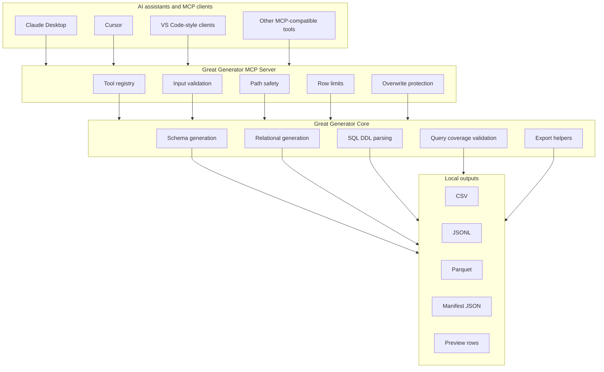

# Great Generator MCP Server

Great Generator includes an optional Model Context Protocol (MCP) server that lets MCP-compatible assistants call selected Great Generator tools from a local developer environment.

The MCP server is local-first. It calls existing Great Generator public APIs, writes generated data to local files, and returns summaries, previews, file paths, warnings, and manifest information.

> This data is synthetic. It was generated by Great Generator. It is not production data, and it is not an anonymized, masked, or de-identified copy of production records.

## 1. What the MCP server does

The MCP server exposes a small tool set for assistant-driven data generation workflows:

- generate synthetic data from schemas
- parse documented SQL `CREATE TABLE` DDL
- generate related tables with local output files
- validate query-aware coverage for generated local datasets
- export supported local generated datasets to CSV, JSONL, or Parquet

It is useful when an assistant or developer tool needs to prepare a local test dataset and hand back paths, row counts, previews, and manifest details.

## 2. What it does not do

The v1 MCP server does not:

- change Great Generator's core generation behavior
- introduce a new generation engine
- call external APIs by default
- connect to production databases
- write to cloud storage or database targets
- execute shell commands
- evaluate user-provided code
- overwrite existing files unless `overwrite=True`
- return full generated datasets through the chat response
- anonymize, mask, de-identify, or transform production records

## 3. Why MCP is useful for Great Generator

Great Generator is schema-first. MCP gives assistants a safe local bridge to ask for generated data, DDL parsing, and query coverage checks without copying large datasets into a conversation.

Instead of returning thousands of rows, the server writes files locally and returns concise metadata:

- output file paths
- row counts
- columns and data types
- small previews
- warnings
- manifest paths
- query coverage reports when requested

## 4. Installation

MCP support is optional. The base package does not require MCP dependencies.

```bash
pip install great-generator
```

Install MCP support only when you want to use an MCP-compatible assistant or developer tool:

```bash
pip install "great-generator[mcp]"
```

Install with a hyphen. Import with an underscore:

```python
import great_generator
```

## 5. Starting the server

Run the server over stdio:

```bash
great-generator-mcp
```

Alternative module form:

```bash
python -m great_generator.mcp.server
```

Stdio is the only transport for v1. HTTP, SSE, WebSocket, database, cloud, and remote transports are intentionally not included.

## 6. Claude Desktop configuration

Example command-based configuration:

```json
{
  "mcpServers": {
    "great-generator": {
      "command": "great-generator-mcp",
      "args": []
    }
  }
}
```

Alternative Python module configuration:

```json
{
  "mcpServers": {
    "great-generator": {
      "command": "python",
      "args": ["-m", "great_generator.mcp.server"]
    }
  }
}
```

If your environment uses a virtual environment, use the full path to that environment's `great-generator-mcp` or `python` executable.

## 7. Cursor configuration

A generic Cursor MCP configuration can use the same command shape:

```json
{
  "mcpServers": {
    "great-generator": {
      "command": "great-generator-mcp",
      "args": []
    }
  }
}
```

If your Cursor version expects a workspace-level MCP file, place the configuration where Cursor documents MCP servers for your version and adjust command paths for your environment.

## 8. Architecture

The MCP server is an optional wrapper over Great Generator public APIs.

```text
MCP client
  -> Great Generator MCP server
  -> safety layer
  -> MCP tool registry
  -> Great Generator public APIs
  -> local output files and manifest
```

The wrapper handles path checks, row limits, overwrite protection, serialization, local output files, and small previews. The existing generation functions still perform the generation work.

## 9. Ecosystem diagram



## 10. Available tools

### `generate_from_schema`

Generates synthetic data from a schema and writes a local output file.

Supported output formats:

- `csv`
- `jsonl`
- `parquet`

Returns:

- status
- output file path
- row count
- columns
- schema summary
- small preview
- manifest path
- query coverage report path when query-aware options are used
- warnings

### `parse_ddl`

Parses documented SQL `CREATE TABLE` DDL into a Great Generator contract summary.

Supported dialect values:

- `ansi`
- `spark`
- `databricks`
- `generic` mapped to `ansi`

This tool does not generate data and does not write files.

### `generate_relational`

Generates related synthetic tables and writes one local file per table.

Returns:

- table names
- row counts
- output file paths
- relationship summary
- schema summary
- small previews by table
- manifest path
- query coverage report path when requested
- warnings

### `validate_query_coverage`

Loads a supported local generated dataset and checks required values, partition values, selectivity targets, and optional join coverage.

Supported input formats:

- `csv`
- `jsonl`
- `json`
- `parquet`

This tool does not modify data.

### `export_dataset`

Loads a supported local generated dataset and writes it to another local format.

Supported output formats:

- `csv`
- `jsonl`
- `parquet`

## 11. Example prompts

```text
Use Great Generator to generate 10,000 synthetic customer records from this schema and save them as CSV in ./synthetic/customers.
```

```text
Use Great Generator to parse this Databricks CREATE TABLE statement and summarize the columns.
```

```text
Generate relational test data for customers and orders. Save one CSV file per table.
```

```text
Generate data that includes region SOUTH and product types CHECKING and SAVINGS. Spread rows across these business dates.
```

```text
Validate whether the generated dataset contains the required query values and partition dates.
```

## 12. Output files and manifests

Generation tools create local output files and a `manifest.json` file in the selected output directory.

The MCP manifest includes:

- generated by Great Generator MCP
- tool name
- generated timestamp
- seed
- row counts
- output files
- schema summary
- required values if provided
- partition settings if provided
- query coverage report path if generated
- synthetic data notice

The response returns the manifest path rather than embedding the full manifest in chat.

## 13. Path safety

Generation tools require `output_dir`. Read tools require supported local input paths.

By default, all paths must stay under the current working directory. Override the allowed root only when you intentionally want a different local workspace:

```bash
set GREAT_GENERATOR_MCP_ALLOWED_ROOT=C:\path\to\workspace
```

On macOS or Linux:

```bash
export GREAT_GENERATOR_MCP_ALLOWED_ROOT=/path/to/workspace
```

The server resolves paths with `Path.resolve()` and rejects paths outside the allowed root.

## 14. Row limits

Default limits:

```text
GREAT_GENERATOR_MCP_MAX_ROWS=100000
GREAT_GENERATOR_MCP_HARD_MAX_ROWS=1000000
```

Behavior:

- requests above `GREAT_GENERATOR_MCP_MAX_ROWS` are rejected unless `allow_large=True`
- requests above `GREAT_GENERATOR_MCP_HARD_MAX_ROWS` are always rejected
- relational generation applies limits per table and to total rows

For very large datasets, use Spark-native generation paths or chunked local workflows outside the MCP response channel.

## 15. Overwrite protection

The MCP server does not overwrite output files by default.

Pass `overwrite=True` only when you intentionally want to replace existing output files or manifest files.

## 16. Synthetic data notice

Every manifest includes this notice:

```text
This data is synthetic. It was generated by Great Generator. It is not production data, and it is not an anonymized, masked, or de-identified copy of production records.
```

## 17. Troubleshooting

### `great-generator-mcp` is not found

Install the optional MCP extra in the same environment used by your MCP client:

```bash
pip install "great-generator[mcp]"
```

If using a virtual environment, configure the MCP client with the full executable path.

### The server says MCP dependencies are missing

The base package was installed without the MCP extra. Install:

```bash
pip install "great-generator[mcp]"
```

### Output path is rejected

The requested path is outside the allowed root. Use a path under the current working directory or set `GREAT_GENERATOR_MCP_ALLOWED_ROOT` to the local workspace you want to allow.

### File already exists

The MCP server protects existing files. Use a new output directory or pass `overwrite=True`.

### Too many rows requested

Lower the requested row count, pass `allow_large=True` for requests above the soft limit, or adjust the row-limit environment variables for your local environment.

## 18. Limitations

- MCP support is optional and local-first.
- v1 uses stdio transport only.
- v1 writes local files only.
- v1 does not expose advisor tools.
- v1 does not connect to databases, cloud storage, or production systems.
- v1 returns previews and summaries, not full generated datasets.
- Spark-native query-aware generation is planned separately; current query-aware shaping is implemented for Pandas generation paths.

## 19. Roadmap

Potential future improvements:

- optional Spark-aware MCP wrappers when safe local cluster configuration is available
- richer manifest validation reports
- additional schema input adapters once they are implemented in the core package
- optional quality-tool report export
- more example MCP prompts for lakehouse, CDC, relational, and data-quality workflows
